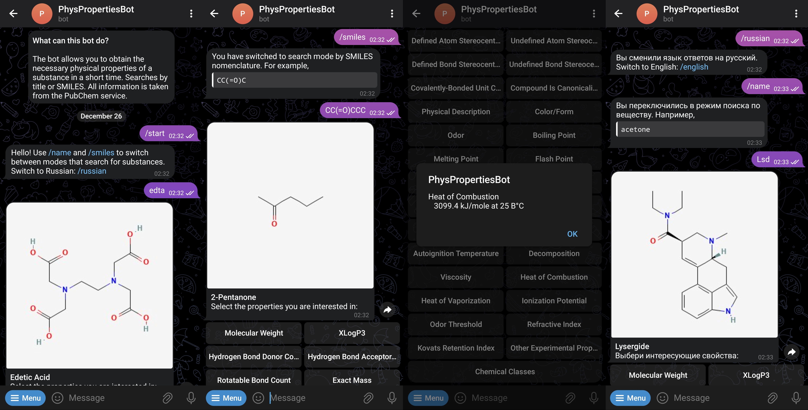

# PhysPropertiesBOT
Do you urgently need any physical properties of a chemical compound? I present TelegramBOT, based on a self-written API for PubChem with only the necessary properties with support for saving results and caching user data.

## API based on PUG REST
Accesses PubChem PUGREST and receives only the necessary properties, saves them in long-term storage so as not to waste time retrieving and processing information.

Technologies:
- FastAPI
- PostgreSQL
  

## TelegramBOT
TelegramBOT with the ability to search for a chemical substance by its name or SMILES nomenclature, as well as obtain its physical properties and descriptors. Performs a call to the API based on PUG REST contained in this repository.

Technologies:
- aiogram
- Redis

