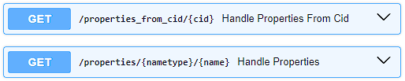

# PhysPropertiesBOT
Do you urgently need any physical properties of a chemical compound? I present TelegramBOT, based on a self-written API for PubChem with only the necessary properties with support for saving results and caching user data.

- [API](#api-based-on-pug-rest)
- [BOT](#telegrambot)
- [FRONTEND](#frontend-using-react)
- [Docker](#deploy-using-docker)


## API based on PUG REST
Accesses PubChem PUGREST and receives only the necessary properties, saves them in long-term storage so as not to waste time retrieving and processing information.

### Technologies
- FastAPI
- PostgreSQL
  


### Handlers

- Allows you to get properties in JSON format by the type of the given name and the name itself. Available types: Name, SMILES and PubChem Compound Identification.
```
GET /properties/{nametype}/{name}
```
- Allows you to get properties in JSON format only by PubChem Compound Identification.
```
GET /properties_from_cid/{cid}
```
### Realisation

- Upon receipt of a request, it checks the presence of the substance in the internal database.
- If it is not there, it turns to PUG REST and converts the format to the JSON form we need.

### How to start

- Create a virtual environment based on python 3.11 inside __python-api__.
```
python3.11 -m venv venv
source venv/bin/activate
```

- Install dependencies:
```
pip install -r requirements.txt
```
- In the virtual environment, create the following variables (change if necessary):
```
export DB_HOST="localhost"
export DB_USER="postgres"
export DB_PASSWORD="pwd"
export DB_NAME="properties"
```
and again
```
source venv/bin/activate
```
- Inside __python-api__ run:
```
uvicorn main:app
```

#BOT
## TelegramBOT
TelegramBOT with the ability to search for a chemical substance by its name or SMILES nomenclature, as well as obtain its physical properties and descriptors. Performs a call to the API based on PUG REST contained in this repository.

### Technologies
- aiogram
- Redis

### Possibilities
- Finding the structure of a substance by its name.
- Switch between search modes by SMILES or NAME.
- Retrieve available physical properties and descriptors by given name or SMILES.

### Realisation
- The bot accesses the API based on PUG REST, described in the previous section.
- Redis is used to save user information.

### How to start

- Create a virtual environment based on python 3.11 inside __python-bot__.
```
python3.11 -m venv venv
source venv/bin/activate
```

- Install dependencies:
```
pip install -r requirements.txt
```
- In the virtual environment, create the following variables (change if necessary):
```
export BOT_TOKEN="<YOUR TOKEN>"
export ADMIN_IDS=" "
export REDIS_HOST="localhost"
export REDIS_PORT="6379"
export REDIS_DB="1"
export API_URL="http://localhost"
export API_PORT="8000"
```
and again
```
source venv/bin/activate
```
- Inside __python-bot__ run:
```
python bot.py
```
## Frontend using React

Web app with the ability to search for a chemical substance by its name or SMILES nomenclature, as well as obtain its physical properties and descriptors. Performs a call to the API based on PUG REST contained in this repository.

### Technologies
- React 20.10.0

### Possibilities
- Finding the structure of a substance by its name.
- Switch between search modes by SMILES or NAME.
- Retrieve available physical properties and descriptors by given name or SMILES.

### Realisation
- The bot accesses the API based on PUG REST, described in the previous section.

### How to start

- In the .env environment, create the following variables (change if necessary):
```
REACT_APP_API_URL = http://localhost:8000
```
- Build app (also need for Docker):
```
npm run build
```
- Run builded app:
```
serve -s build
```
- Or just run:
```
npm run start
```
## Deploy using Docker
- Set up the following .env files:
```
.env.api
.env.bot (.env.bot.example as example)
.env.db
```
- Build react-frontend app.
- Run:
```
docker-compose up -d --build
```
